# OrbitQ · Expo App

   

The OrbitQ mobile client — a React Native app for tracking rocket launches, receiving push notifications, and exploring mission details. This document covers the app's architecture, state design, features, and build system. For the backend that powers it, see [orbitq-api-docs](https://github.com/jamus/orbitq-api-docs).

<div align="center">
  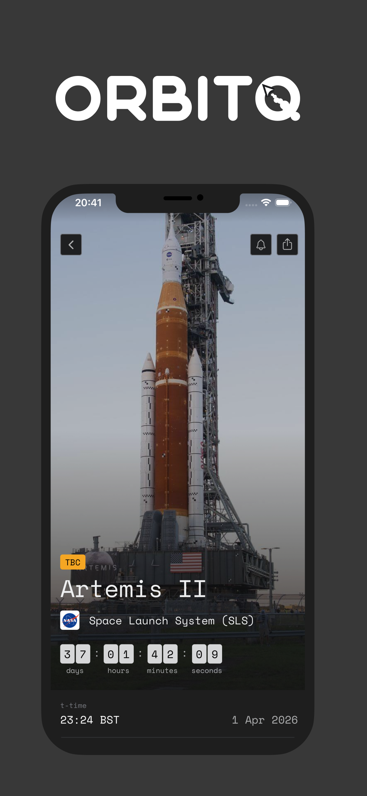
  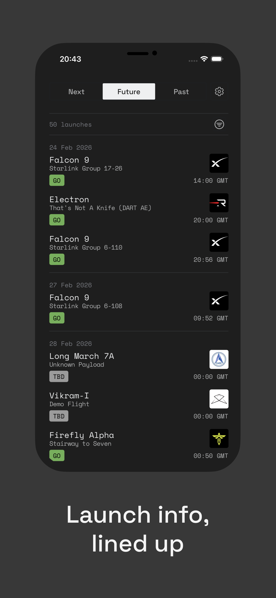
  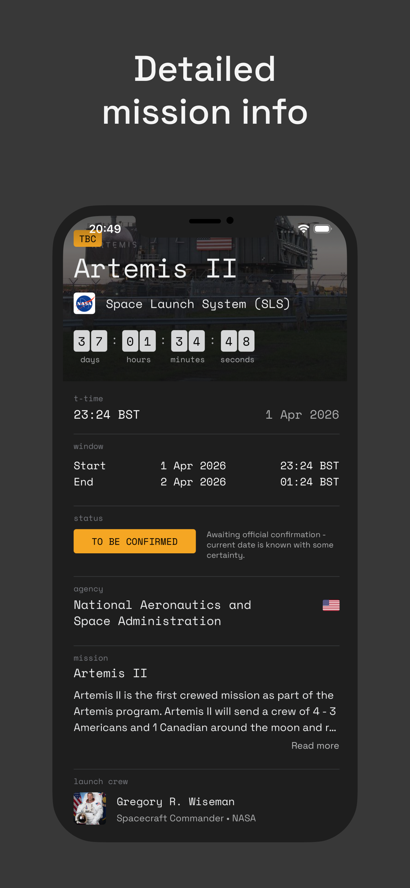
  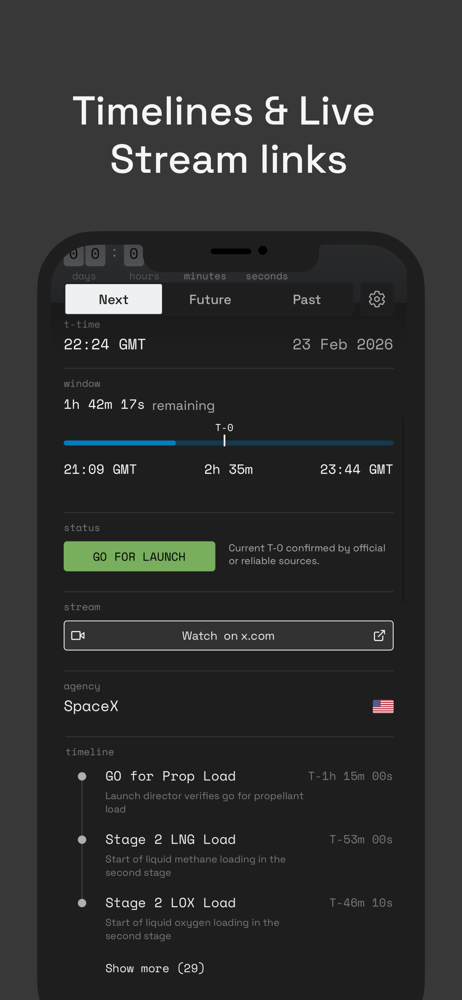
  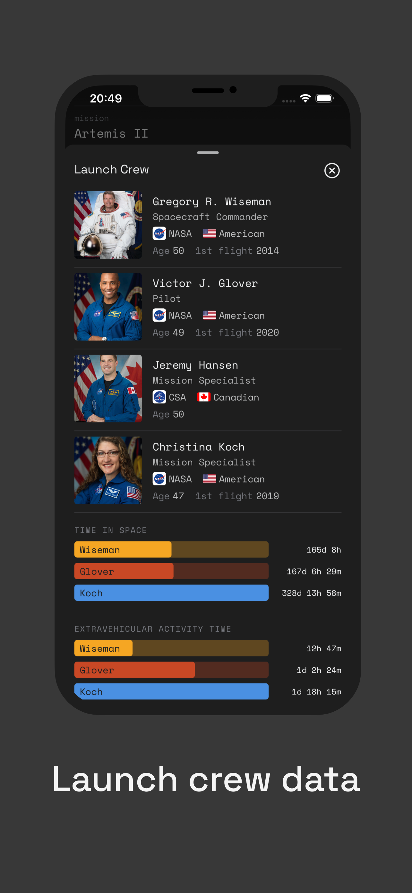
  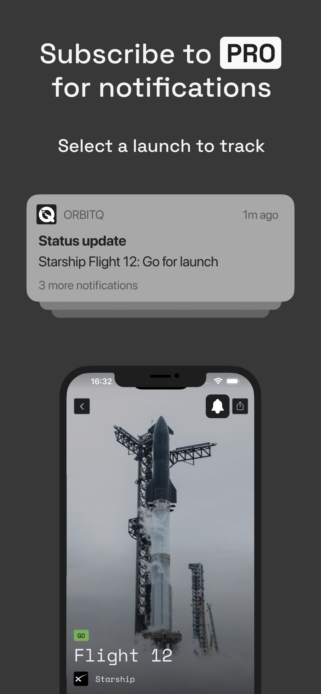
</div>

<div align="center">
  <sub>
    Launch detail · Future launches · Mission info · Timeline & streams · Crew · Pro notifications
  </sub>
</div>

---

## Tech Stack

### Runtime

| Layer          | Technology                          | Version |
| -------------- | ----------------------------------- | ------- |
| Language       | TypeScript                          | 5.9     |
| State          | Redux Toolkit + redux-persist       | 2 / 6   |
| Framework      | Expo (managed workflow)             | 54      |
| Navigation     | expo-router (file-based routing)    | 6       |
| Notifications  | expo-notifications                  | 0.32    |
| Maps           | Mapbox                              | 10      |
| Subscriptions  | react-native-purchases (RevenueCat) | 9       |
| Error tracking | Sentry                              | 7       |
| Analytics      | Vexo analytics                      | 1.5     |

### Tooling

| Tool                                     | Purpose                                                         |
| ---------------------------------------- | --------------------------------------------------------------- |
| EAS Build                                | Cloud builds across development / preview / production profiles |
| EAS Update                               | OTA JS updates with `appVersion` runtime policy                 |
| jest-expo + React Native Testing Library | Unit and integration tests                                      |
| Husky + ESLint + Prettier                | Pre-commit hooks, consistent formatting                         |
| Redux Expo devtools                      | In-app Redux DevTools during development                        |

---

## Architecture

The app uses a **Stack-at-root** layout with three nested areas: a Material Top Tabs navigator for the main browsing experience.

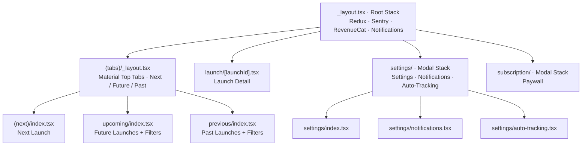

The root layout wraps the entire tree with `GestureHandlerRootView` (required for bottom sheet gestures), `BottomSheetModalProvider`, Redux `Provider`, and `PersistGate`. `Sentry.wrap` decorates the root component for automatic error boundary capture.

---

## State Management

Eight Redux slices cover every domain of the app.
Two are persisted to AsyncStorage — the rest are always fetched fresh.

| Slice                     | Persisted                                  | Handles                                                                             |
| ------------------------- | ------------------------------------------ | ----------------------------------------------------------------------------------- |
| `launches`                | No                                         | Upcoming + past launch lists, loading/error state, `lastUpdated` timestamps         |
| `launchDetails`           | No                                         | Per-launch detail entities keyed by `launchId`, loading/notFound maps               |
| `filters`                 | **Yes** — `upcoming` + `previous` sub-keys | Selected agency + status IDs for upcoming and past list filter panels               |
| `tracking`                | **Yes** — `deviceToken` only               | Device push token only — tracked launch list is always fetched fresh on boot        |
| `subscription`            | No                                         | `isSubscribed`, `subscriptionInfo`, `lastUpdated`                                   |
| `notificationPreferences` | No                                         | Per-type notification toggle state (24h, 1h, 5m, status update, schedule change)    |
| `autoTracking`            | No                                         | Agency and location IDs for auto-track rules                                        |
| `config`                  | No                                         | Available launch statuses, full agencies list, full locations list (for filter UIs) |

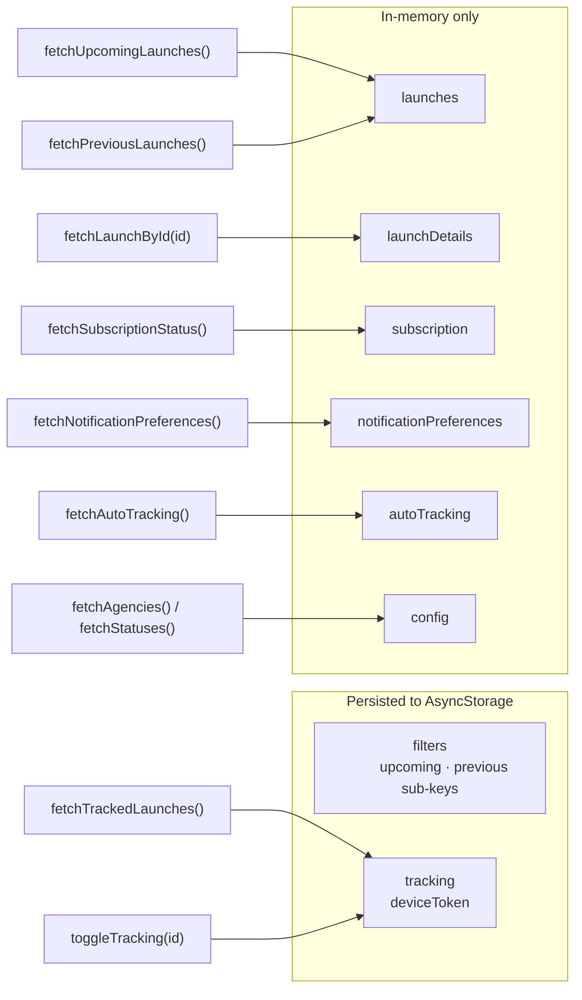

> **Why persist both filter sub-keys?** Both upcoming and past launch filters express a browsing preference users expect to survive restarts. A nested `persistConfig` on the `filters` slice whitelists both `upcoming` and `previous` sub-keys — this is necessary because `redux-persist` whitelists operate at the reducer key level, not field level.

### Boot Sequence

The following sequence runs every time the app launches (or returns to the foreground after the tab layout mounts):

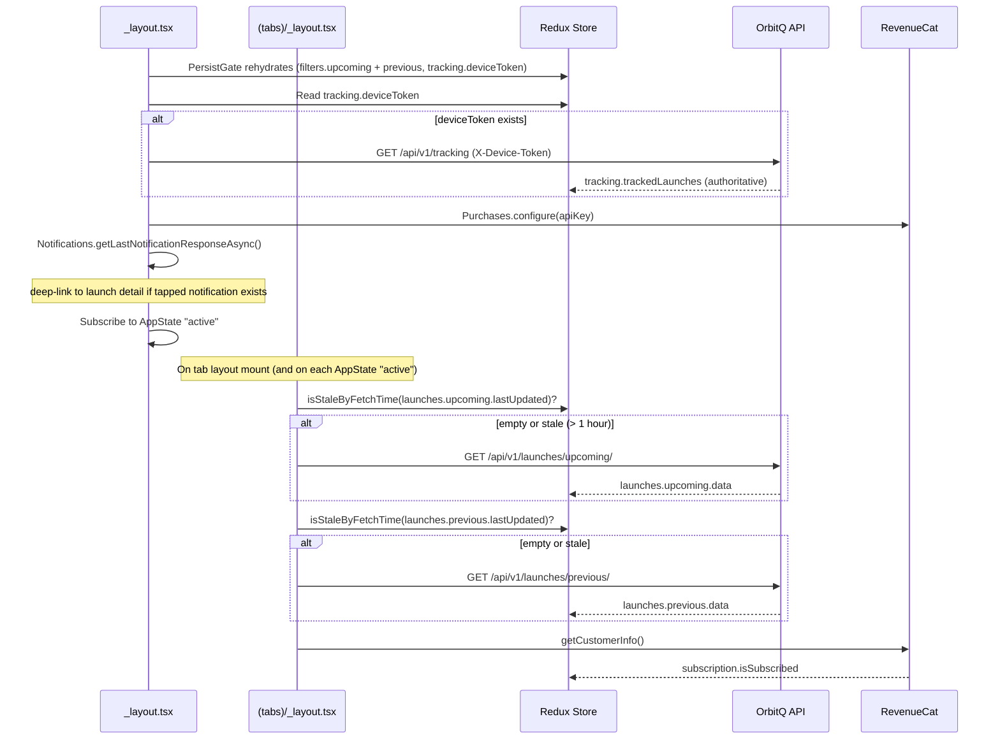

> **Staleness-based refresh, not polling.** The `isStaleByFetchTime` utility applies a one-hour threshold. If the user switches apps briefly and returns, no request is made. After an extended background period, all three resources (upcoming launches, past launches, subscription status) are refreshed together.

---

## Features

### Next Launch

The first tab always displays the chronologically nearest upcoming launch as a full detail view. `findNextLaunchByDate` selects the launch from the already-loaded upcoming list, so no additional list request is made on tab switch. Pull-to-refresh re-fetches the upcoming list, derives the new next launch ID, and fetches the detail if the ID has changed.

<div align="center">
  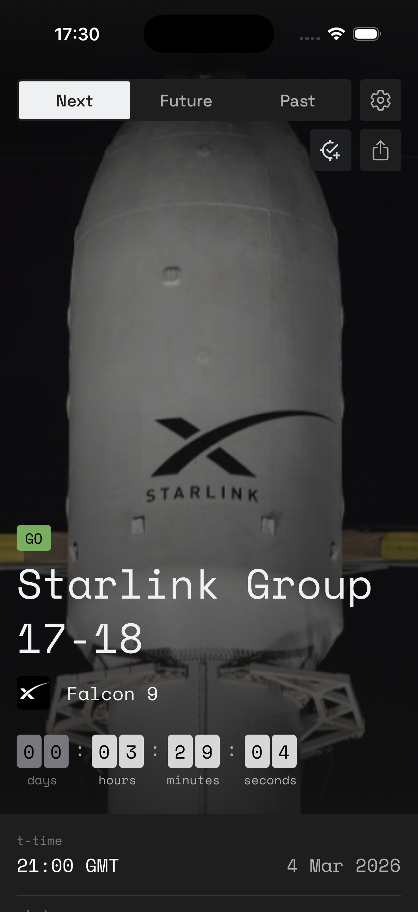
</div>

<div align="center">
  <sub>Next launch detail view</sub>
</div>

### Future and Past Lists

Paginated launch lists with bottom-sheet filter panels. Filters operate client-side against the already-fetched list — `selectFilteredUpcomingLaunches` applies selected agency and status IDs without triggering additional API calls. Filters are persisted across sessions. Both lists support pull-to-refresh.

<div align="center">
  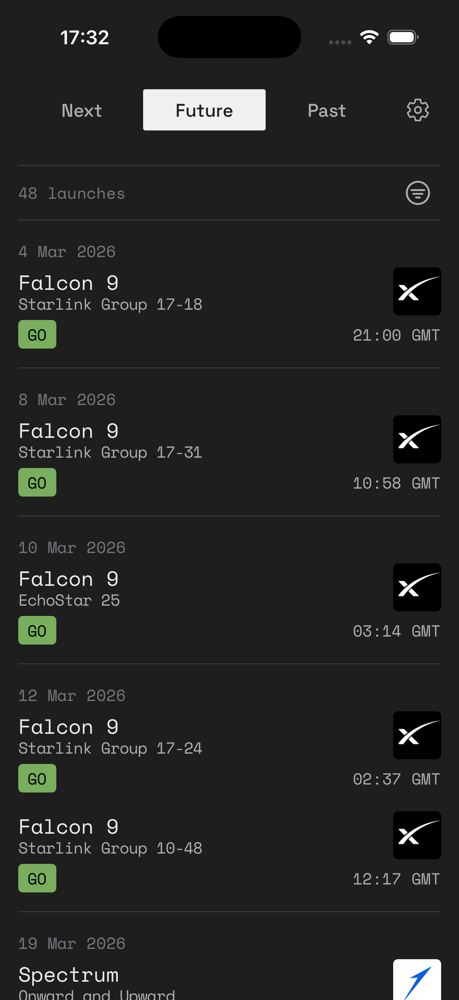
  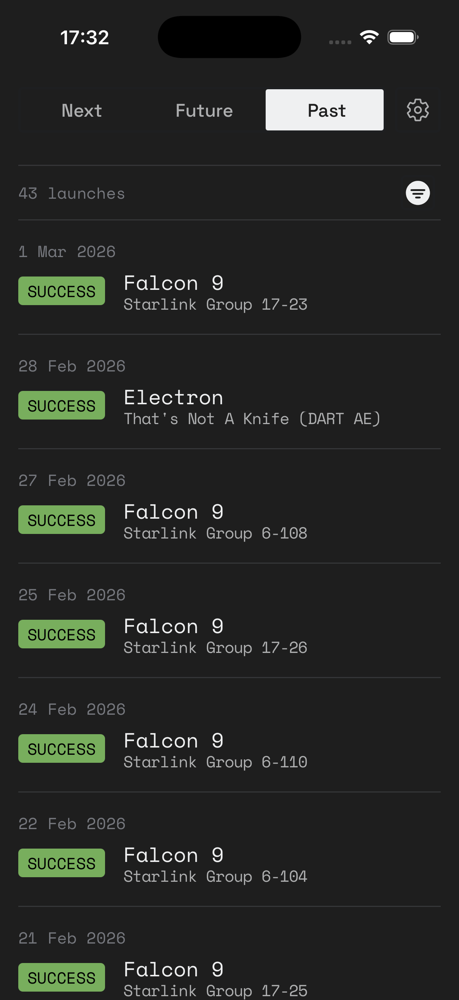
</div>

<div align="center">
  <sub>Future and past launch lists</sub>
</div>

### Launch Detail

The most visually complex screen: full-bleed hero image with a `LinearGradient` overlay, live countdown (or T-time for past launches), status pill, webcast links, mission description, crew section, vehicle specs, a Mapbox launch pad map, and a mission timeline. `LaunchDetailContainer` implements progressive rendering — it converts the list-level `Launch` object into a partial detail immediately on navigation, while skeleton components stand in for the detail-only sections (timeline, videos, updates) until the full `LaunchDetail` response arrives. There is no blank loading screen for launches.

<div align="center">
  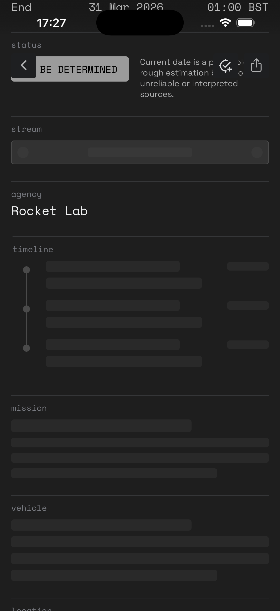
</div>

<div align="center">
  <sub>
    Progressive rendering — skeleton sections fill in as the detail response arrives
  </sub>
</div>

### Launch Tracking

Each launch card and detail screen shows a `TrackButton` that resolves to one of six modes depending on app state:

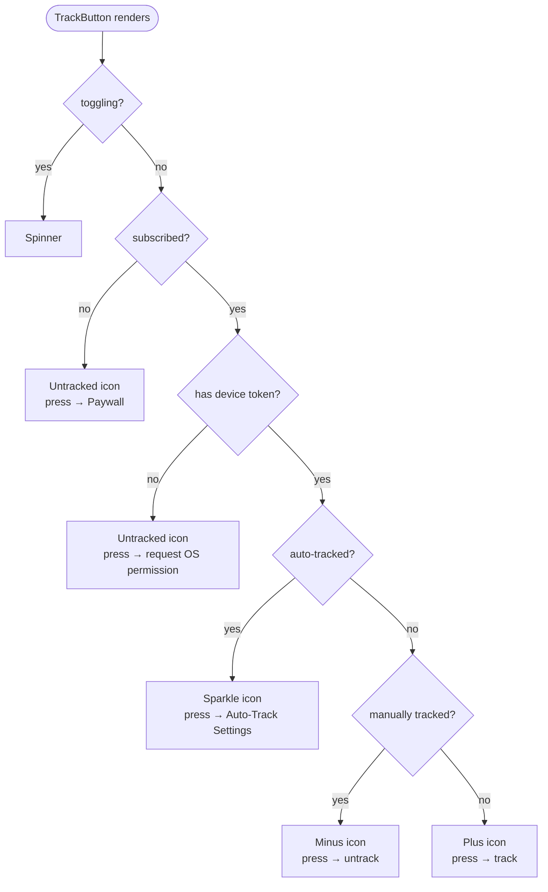

On press, `handleManualPress` checks subscription, ensures a device token exists (requesting OS notification permission if not), then dispatches `toggleTracking(launchId)` which calls `POST` or `DELETE` on the tracking API. A toast confirms the result.

### Auto-Tracking

Users configure agency and/or launch site filter rules in settings; the server monitors upcoming launches against these rules and automatically tracks matching ones. Auto-tracked launches show a sparkle icon in place of the standard track icon. Tapping an auto-tracked button routes to the Auto-Tracking settings screen rather than toggling, preventing accidental removal of server-managed tracking.

<div align="center">
  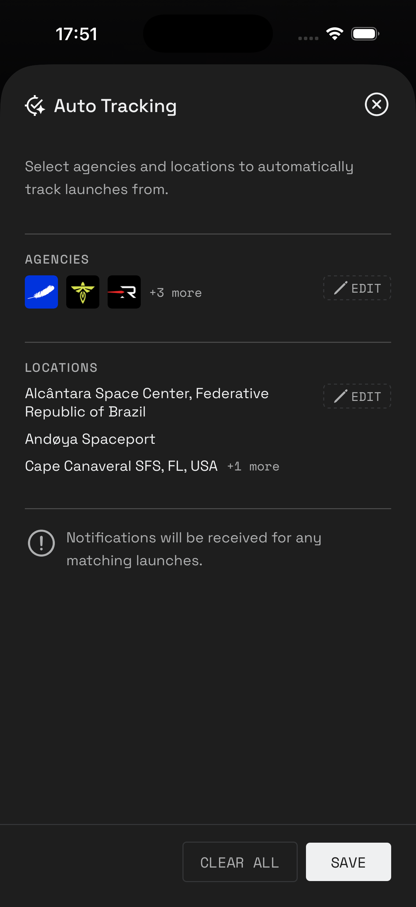
  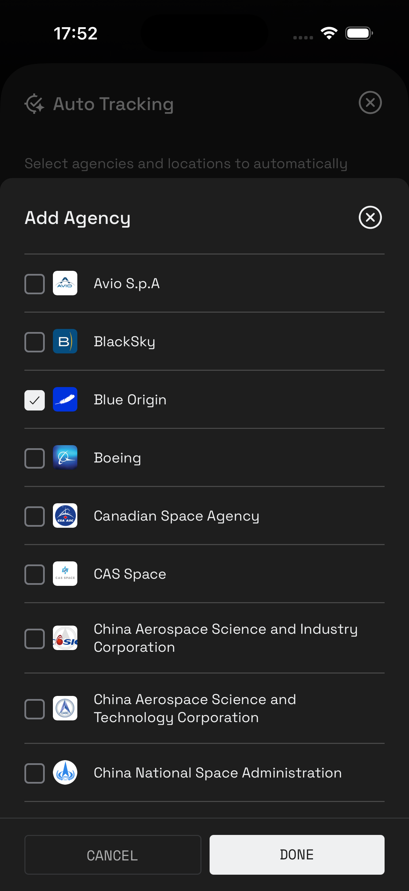
  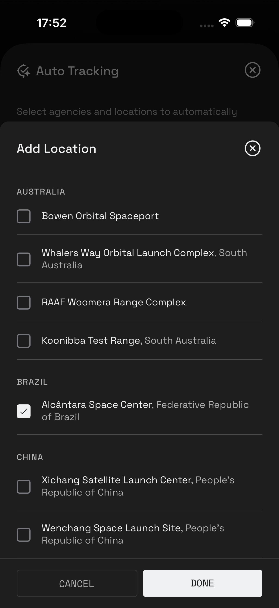
</div>

<div align="center">
  <sub>
    Auto-tracking configuration — agency and launch site filter rules
  </sub>
</div>

### Notification Preferences

Five per-type toggles for tracked launches: 24-hour warning, 1-hour warning, 5-minute warning, status update, and schedule change. The UI uses optimistic updates — current preferences are saved to a local rollback variable before the `PUT` request, and restored on failure.

### Notification Deep Linking

On notification tap, the app reads `launchId` and `notificationType` from the notification payload. Notifications of type `launch_update`, `status_update`, or `schedule_change` navigate to the detail screen with `?showUpdate=true`, surfacing the latest update section first. `net_warn` notifications navigate with `?netWarn=true` to highlight the countdown.

### Pro Subscription

> **Currently disabled while in TestFlight Beta**
> (Join here: https://www.orbitq.app/ - feedback welcome!)

RevenueCat gates the tracking and auto-tracking features behind an "OrbitQ Pro" entitlement. Subscription status is checked on every app foreground event. The `subscription/` modal stack presents the RevenueCat paywall UI. Unsubscribed users who attempt to track a launch are routed directly to the paywall.

---

## API Integration

All requests use native `fetch` — no Axios, no React Query. Authentication uses two header mechanisms:

- **`api-key`** — required on all requests, injected by `services/api/config.ts`
- **`X-Device-Token`** — required on device-scoped resources (tracking, preferences, auto-tracking), propagated from `state.tracking.deviceToken`

`services/api/config.ts` resolves the base URL at runtime: in development, it reads `Constants.expoConfig.hostUri` to extract the Metro bundler's IP address, so physical device testing against a local API server requires no manual configuration. In production, it points to the hosted API.

| Resource                 | Endpoints                                                                | Auth                     |
| ------------------------ | ------------------------------------------------------------------------ | ------------------------ |
| Launch lists             | `GET /api/v1/launches/upcoming/` · `GET /api/v1/launches/previous/`      | api-key                  |
| Launch detail            | `GET /api/v1/launches/{id}`                                              | api-key                  |
| Tracking                 | `GET / POST / DELETE /api/v1/tracking`                                   | api-key + X-Device-Token |
| Auto-tracking            | `GET / PUT /api/v1/auto-tracking`                                        | api-key + X-Device-Token |
| Notification preferences | `GET / PUT /api/v1/notification-preferences`                             | api-key + X-Device-Token |
| Config/filter options    | `GET /api/v1/agencies` · `/api/v1/locations` · `/api/v1/launch-statuses` | api-key                  |

> **Why device tokens instead of user accounts?** OrbitQ requires no login. All per-user personalisation — tracking lists, notification preferences, auto-track rules — are keyed to the device's push token. The token is obtained on first use (when the user tracks a launch or enables notifications), persisted locally via redux-persist, and used on every subsequent app launch to re-sync tracking state from the server. This eliminates account management complexity entirely. The tradeoff is that tracking state is non-transferable across devices. See [orbitq-api-docs](https://github.com/jamus/orbitq-api-docs) for the server-side implementation of device-scoped resources.

---

## Component Architecture

Components are organized in three layers:

**Detail view** (`components/launch/`) — `LaunchDetailContainer` handles data fetching, loading/error/empty state delegation, and progressive rendering coordination. It delegates rendering to a suite of section components — `DetailsInfo`, `DetailsMission`, `DetailsLocation`, `DetailsTimeline`, `DetailsVideos`, `DetailsUpdates` — each paired with a `Skeleton*` counterpart that renders during the detail fetch window.

**List view** (`components/launch-list/`) — `LaunchList` and `LaunchListItem` are used by both the Future and Past tabs. `LaunchListItem` renders a `TrackButton` and a `ShareButton` alongside the launch summary.

**UI primitives** (`components/ui/`) — `TrackButton`, `ShareButton`, `ErrorView`, `EmptyView`, `LoadingView`, `SkeletonBox`, `LaunchStatusPill`, `AgencyLogo`, `CountryFlag`. These are stateless or lightly-connected components shared across screens.

---

## Design System

All design tokens are defined in `constants/theme.ts`.
A naive Tailwind like approach that will be replaced when it starts to feel painful.

**Typography** — two custom font families:

| Family        | Variants                          | Usage                                                           |
| ------------- | --------------------------------- | --------------------------------------------------------------- |
| Space Mono    | Regular, Bold, Italic, BoldItalic | Technical values: countdowns, timestamps, IDs, uppercase labels |
| Space Grotesk | Light, Regular, Medium, Bold      | All other UI text: labels, descriptions, settings               |

**Colour scale** — Tailwind-style naming from `grey50` (#EFF0F1) through `grey950` (#1E1F21), with five semantic status colours (positive, negative, warning, info, neutral), each available as a solid and a 30%-opacity tint variant.

**Spacing** — 4 px base unit: `xsmall` (4) · `small` (8) · `medium` (16) · `large` (24) · `xlarge` (32).

**Radius** — `xsmall` (2) · `small` (4) · `medium` (8) · `large` (12) · `xlarge` (16).

---

## Build & Deployment

Builds are managed via EAS. App version is sourced from EAS (`appVersionSource: remote`) rather than `package.json`.

| Profile         | Distribution | Channel         | Notes                                                 |
| --------------- | ------------ | --------------- | ----------------------------------------------------- |
| `development`   | Internal     | `development`   | Includes `expo-dev-client`, `APP_VARIANT=development` |
| `preview`       | Internal     | `preview`       | Production JS bundle, internal distribution           |
| `production`    | Store        | `production`    | `autoIncrement: true`, remote iOS credentials         |
| `ios-simulator` | —            | `ios-simulator` | Extends `development`, simulator target               |

OTA updates are pushed via `eas update`:

```sh
npm run update:preview      # → preview branch
npm run update:production   # → production branch
```

Updates are tied to `appVersion` (runtime policy), so a JS update only reaches users on the matching app version.

---

## Related

- [orbitq-api-docs](https://github.com/jamus/orbitq-api-docs) — the OrbitQ backend API: architecture, endpoints, background jobs, and data flow
- [Expo Documentation](https://docs.expo.dev)
- [The Space Devs · Launch Library 2](https://thespacedevs.com/llapi) — the upstream launch data source powering the OrbitQ API
